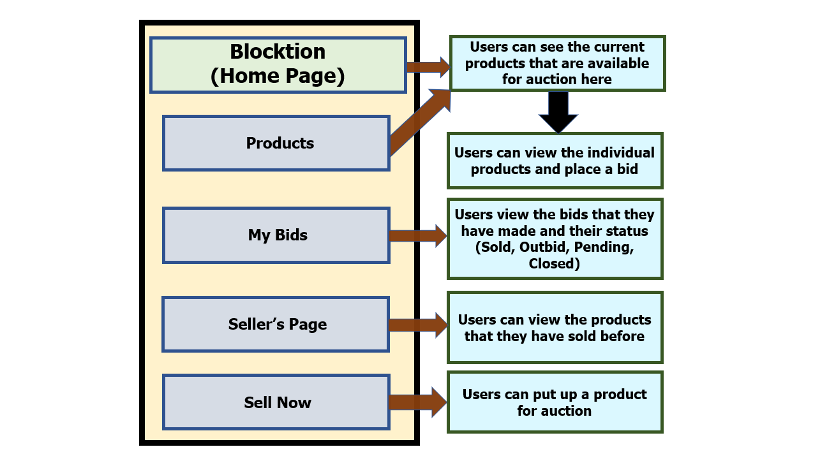

# BlockchainAuction
Team 4 Auction dApp

## Project Idea
BlockchainAuction is a Web App for aunctioning Products using Blockchain coupled with ethereum accounts running on a ropsten server. Users can auction off anything on the chain that is available to them. The smart contract holds the auctioned asset and thereafter it manages bids associated in a seamless fashion.

The reason why Blockchain forms such a great platform is the promise of accuracy and guarantee of payment thanks to immutability of Blocks and allows for a more transparent, strict and fair auction experience.

More platforms like E-Bay are considering Blockchain as a next step to secure their transactions.
- Read more about this: https://news.bitcoin.com/ebay-can-stop-fraud-overnight-using-blockchain/

## User Flow

## User Stories
Priorities: High (must have) - `* * *`, Medium (nice to have) - `* *`, Low (unlikely to have) - `*`

| Priority | As a …​                                    | I want to …​                     | So that I can…​                                                        |
| -------- | ------------------------------------------ | ------------------------------ | ---------------------------------------------------------------------- |
| `***`  | seller | begin a product auction with a name, description and deadline.| |
| `***`  | seller | set a lower bound for the product | prevent buyers from bidding too low.|
| `***`  | seller | view all my active products | have an overview of my products and manage them.|
| `***`  | seller | close active auctions and notify them | return ether back to those who bidded.|
| `***`  | buyer | view all products and its lower bound price| easily have an overview of everything that is available to bid for.|
| `***`  | buyer | place bids before a specified deadline | be aware of when the auction will end. |
| `***`  | buyer | see all my placed bids | remember my initial bid and adjust accordingly. |
| `***`  | buyer | see the number of bids for a product | roughly understand the popularity of a product and adjust my bid. |
| `***`  | buyer | see the highest bid | place a new bid that is higher than the current highest bid. |
| `***`  | buyer | avoid placing bids after a deadline | prevent my ether from going to waste for an auction that is already over. |
| `**`  | 	seller | upload pictures for the products.| |
| `**`  |	seller | see my previous list of auctions and winners.||
| `**`  |	buyer | sort products by category | easily navigate through the products and find what I’m looking for. |